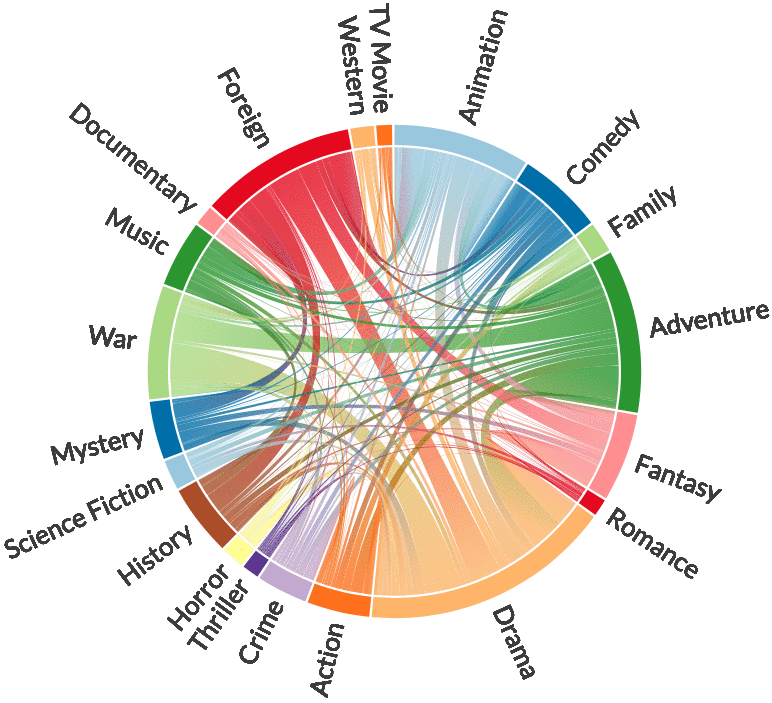

# chord diagram of movie genre

Experiment chord diagram to show co-occurences of genres among moives.

## data
Consider the metadata of 45,000 movies listed in the Full MovieLens Dataset. 
[source](https://www.kaggle.com/rounakbanik/the-movies-dataset/data#movies_metadata.csv)

## genre - wrangling with json
build a chord diagram by Chord

can insert an html in md, here we go:
